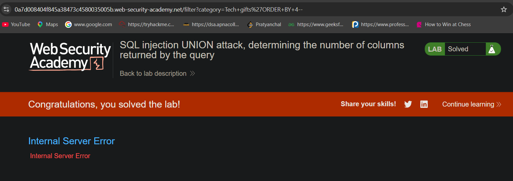
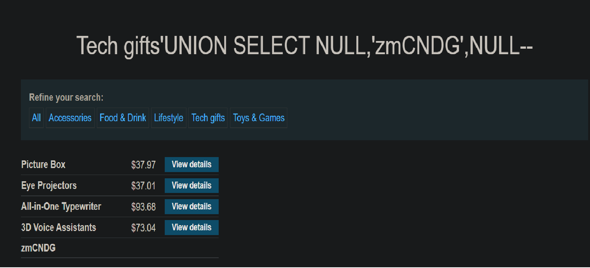
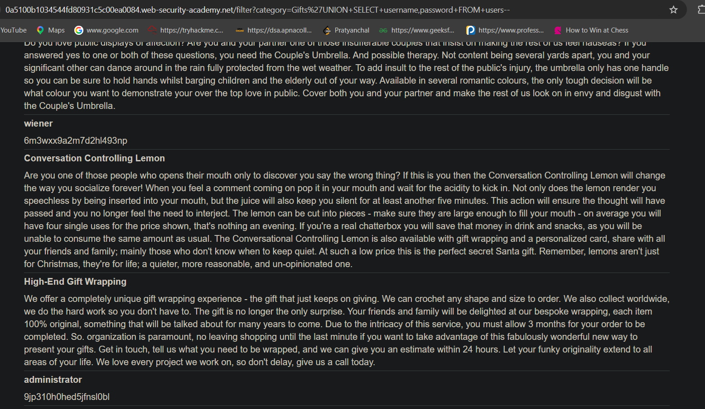
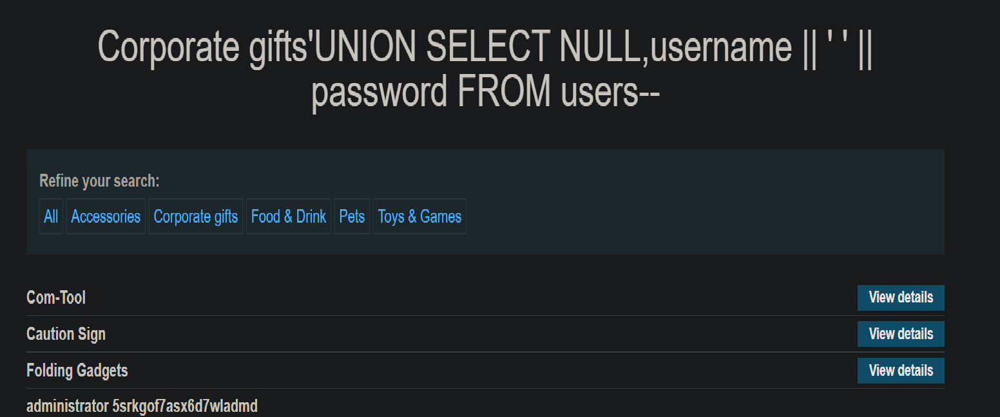

# SQL Injection: UNION Attacks

**Platform:** PortSwigger Web Security Academy
**Difficulty:** Apprentice to Practitioner
**Topic:** SQL Injection

## Objective
The application filters products by category using a URL parameter that reaches the database unsanitized. The goal across this arc was to use UNION-based SQL injection to go beyond bypassing filters, and instead pull arbitrary data out of the database, including from tables the application was never meant to expose, ending in full account takeover via leaked credentials.

## Vulnerability Overview
A UNION attack works by appending a second SELECT statement to the application's original query using the UNION keyword, so the database returns the combined results of both queries in a single response. For this to succeed, the injected query must return the same number of columns as the original, and each column's data type must be compatible across both queries. Once those two constraints are satisfied, an attacker can select data from any table the database account can read, not just the one the application intended to query, and have it rendered directly in the page's existing output fields.

## Methodology

### Step 1: Determine the number of columns
Before any UNION attack can work, the injected query has to match the original query's column count exactly, or the database rejects it. I tested this two ways. First, I used ORDER BY with an increasing column number, since ORDER BY references columns by position, and referencing a position that doesn't exist causes an error. The error appeared at position 4, meaning the real query only returns 3 columns. Second, I confirmed this independently with UNION SELECT NULL,NULL,NULL, since NULL is valid for any data type and will never throw a type-mismatch error on its own, isolating the check to column count alone. Both methods agreed on 3 columns.

### Step 2: Identify which column accepts string data
Matching column count isn't enough, each column also has an underlying data type, and UNION requires type compatibility position by position. I substituted a test string into one column position at a time, leaving the others NULL. Two positions errored, rejecting the string outright, while one succeeded and the string appeared directly in the page's product listing. That told me two things at once, which column type was string-compatible, and that the same column was actually rendered in visible output, not just accepted silently, which matters because a column could accept a string internally without ever being displayed back to the user.

### Step 3: Retrieve data from an unrelated table
With the column count and compatible column identified, I replaced the second half of the UNION query with a SELECT against the users table instead of products. The database had no concept of which table the application intended to query, it only enforces column count and type compatibility between the two SELECT statements, not which table either one reads from. This let me pull every row of the users table, usernames and passwords, directly into the page's existing product display, which I then used to log in as administrator.

### Step 4: Exfiltrate multiple values through a single usable column
A later lab only exposed one string-compatible column, instead of two, while I still needed to retrieve two separate values, username and password. Since a UNION attack is limited to as many usable output slots as the query provides, I concatenated both values into the single available column using a separator character, producing one combined string that I could split apart by eye once rendered on the page. This showed that a lack of multiple usable columns doesn't block exfiltration, it just forces the data into fewer slots.

## Payloads
Gifts'+ORDER+BY+4--
Gifts'+UNION+SELECT+NULL,NULL,NULL--
Gifts'+UNION+SELECT+'alrxe8',NULL,NULL--
Gifts'+UNION+SELECT+NULL,'alrxe8',NULL--
Gifts'+UNION+SELECT+NULL,NULL,'alrxe8'--
Gifts'+UNION+SELECT+username,password+FROM+users--
Gifts'+UNION+SELECT+NULL,username||' '||password+FROM+users--

## Proof of Exploitation

## Root Cause and Remediation
**Root cause:** the application concatenates user input directly into the SQL query, allowing an attacker to append an entirely separate SELECT statement rather than just modifying the existing one. This is compounded by a second issue, the database account the application uses has read access well beyond what the application itself needs, which is what made pulling data from the unrelated users table possible once the injection point existed at all.

**Fix:** use parameterized queries so user input can never be interpreted as additional SQL syntax, closing off the injection point entirely. Separately, apply the principle of least privilege to the application's database account, restricting it to only the tables and columns the application actually needs, so that even if an injection point is later found, the blast radius of what it can reach is limited.

## Key Takeaway
A UNION attack turns column counting and type matching into a reconnaissance problem, not a limitation, once an attacker can see enough of a query's shape to line up a second SELECT statement, the attack is bounded only by what the database account itself can read, which is why input sanitization and database privilege scoping are both necessary, neither one alone is sufficient.
